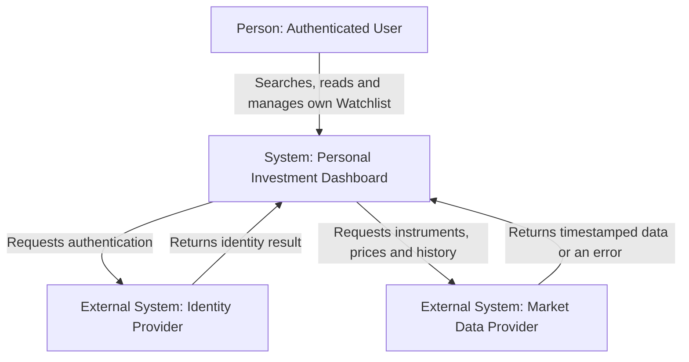

# Laboratory 1 — Define the Initial Product

## 1. Product research

**Research question:** How do existing products help users track market information, and which parts belong in the first Dashboard version?

| Product | Likely user and goal | Reusable pattern |
|---|---|---|
| Google Finance | Individual investor monitoring selected securities without trading. | Market overview, search, stock details, history and personal watchlist. |
| TradingView | Investor comparing instruments and following prices and charts. | Fast search, filters, watchlists, timestamps and market status. |

**Evidence reviewed on 21 September 2026:**

- [Google Finance](https://www.google.com/finance/) combines market information, search, instrument details and personal lists.
- [TradingView Mobile](https://www.tradingview.com/mobile/) presents charts, market data and watchlists.
- [TradingView Stock Screener](https://www.tradingview.com/screener/) demonstrates filtering and comparison.

**Scope decision:** Version 1 includes Overview, Search, Filter, Stock detail, price history and a private Watchlist. Trading, broker connections, alerts and advanced technical analysis are excluded.

## 2. Stakeholders and actors

| Stakeholder | Motivation | Influence | Reason |
|---|---|---|---|
| Authenticated user | High | High | Uses the product and evaluates its usefulness. |
| Product owner | High | High | Defines scope and priorities. |
| Development/operations team | High | High | Builds and maintains the product. |
| Market Data Provider | High | High | Supplies instrument, price and history data. |
| Regulators | Low | High | Influence transparency and data-protection requirements. |
| Unauthenticated visitor | Low | Low | Has no access to private functions in version 1. |

| Motivation | Low influence | High influence |
|---|---|---|
| High | — | User; Product owner; Team; Market Data Provider |
| Low | Unauthenticated visitor | Regulators |

| Candidate | Classification | In System Context? |
|---|---|---|
| Authenticated user | Direct human actor | Yes |
| Market Data Provider | Direct external system | Yes |
| Identity Provider | Direct external system | Yes |
| Product owner, team, regulators, visitor | Other stakeholders | No |

## 3. Product promise and scope

**Personal Investment Dashboard helps an authenticated individual investor track selected stocks and market conditions so that current information is found quickly and delayed or unavailable data is always clear.**

### Goals

1. Show an overview of supported and watched stocks.
2. Find a stock by ticker or company name.
3. Filter stocks by exchange and sector.
4. Show latest price, provider timestamp and price history.
5. Maintain a private Watchlist and clearly mark delayed or unavailable data.

### Non-goals

1. Buy/sell orders or broker integration.
2. Personalised investment advice, predictions or portfolio-risk analysis.
3. Real-time alerts, public sharing or collaboration.

## 4. Functional requirements

### DASH-1 — Overview

**Actor goal:** Understand relevant stock activity quickly.

**User story:** As an authenticated user, I want an overview of supported stocks so that I can identify relevant prices and movements.

**Definitions of Done:**

- Each result shows symbol, name, latest price, change and provider timestamp.
- A missing price is “Unavailable”, never zero.
- Old data is visibly marked as delayed.

### DASH-2 — Search

**Actor goal:** Find a known stock quickly.

**User story:** As an authenticated user, I want to search by ticker or company name so that I can find a stock without browsing the full list.

**Definitions of Done:**

- Search returns supported matching stocks.
- No match produces an explicit empty result.
- Unsupported instruments are not presented as supported stocks.

### DASH-3 — Filter

**Actor goal:** Narrow results to a relevant group.

**User story:** As an authenticated user, I want to filter by exchange and sector so that I can compare relevant stocks.

**Definitions of Done:**

- Results satisfy all selected filters.
- Removing filters restores the complete set.
- No matches produce an empty state, not an error.

### DASH-4 — Stock details and history

**Actor goal:** Interpret the latest price in historical context.

**User story:** As an authenticated user, I want stock details and price history so that I can understand movement over time.

**Definitions of Done:**

- Identity, price, currency, provider time and history are displayed.
- Missing historical points are not replaced with invented values.
- Unacceptable provider data is marked “Unavailable” or “Delayed”.

### DASH-5 — Private Watchlist

**Actor goal:** Maintain a personal stock list.

**User story:** As an authenticated user, I want to add and remove stocks from my Watchlist so that I can follow instruments that interest me.

**Definitions of Done:**

- The next read after confirmation reflects the change.
- Duplicate additions do not create duplicate entries.
- A user can access only their own Watchlist; unauthorised access is denied.

## 5. C4 System Context

| External system | Owned result | Dashboard responsibility |
|---|---|---|
| Market Data Provider | Instrument identity, prices, timestamps and history | Never invent values; display “Delayed” or “Unavailable”. |
| Identity Provider | Confirmed identity | Deny invalid access and never expose another user's data. |

