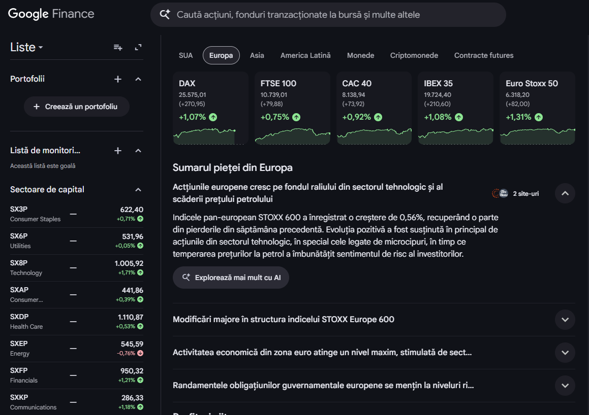
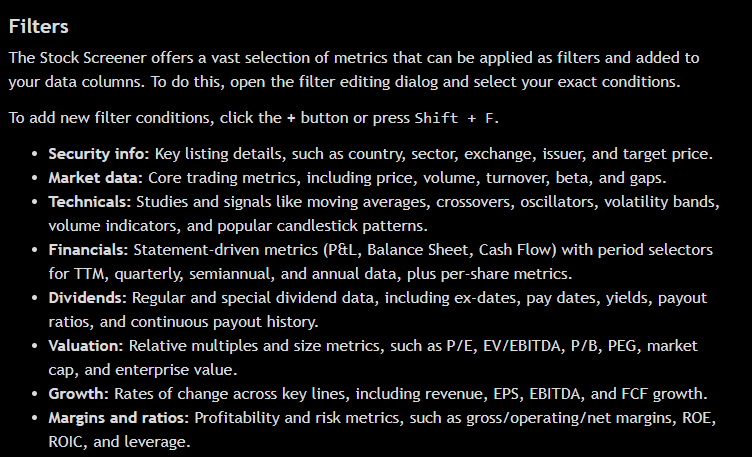
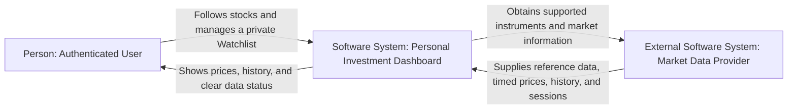

# Laboratory 1 — Define the Initial Product

**Student:** Oprea Alexandru · **Group:** InfA241 · **Language:** English  
**Product:** Personal Investment Dashboard · **Research date:** 21 September 2026

[Laboratory index](../README.md) · [Lab 2](../lab-2/README.md) · [Assignment](https://github.com/AlexOp27-z/system-design-labs/blob/main/labs/01-product-framing/README.md) · [Lecture 2](https://github.com/AlexOp27-z/system-design-labs/blob/main/lectures/lecture-02-product-scope-and-system-boundaries.md)

## 1. Product research

**Research question:** How do existing products help a user follow market information, and which parts belong in this Dashboard's first version?

The research uses public product pages and official help articles. Likely users below are inferred from the documented features, not from user interviews.

| Product | Likely user and goal | Reusable pattern | Evidence |
| --- | --- | --- | --- |
| Google Finance — market-information product | An individual following selected companies who wants to find their prices and understand changes over time. | A broad market summary, instrument search, a price-history view, and a saved list of followed securities. | [Finance homepage](https://www.google.com/finance/) and [official follow/compare/watchlist guide](https://support.google.com/websearch/answer/7579076?hl=en). |
| TradingView — trading-oriented analysis product | A user comparing a large set of instruments and narrowing it to relevant candidates. | Combining exchange and sector filters; showing instrument identity alongside price information. | [Stock Screener](https://www.tradingview.com/screener/) and [official screener guide, especially Filters](https://www.tradingview.com/support/solutions/43000718866-tradingview-stock-screener-trade-smarter-not-harder/). |

### What the evidence changed or confirmed

| Observation | Product decision | Traceability |
| --- | --- | --- |
| Google documents searching for securities, viewing charts, and maintaining watchlists. | Confirm Search, Stock detail, price history, and a personal Watchlist as the smallest useful monitoring workflow. The Dashboard will enforce privacy; that is our requirement, not a claim that another product has identical access rules. | DASH-2, DASH-4, DASH-5 |
| Google's overview presents market information without requiring the user to place an order. | Interpret “follow my investments” as following selected stocks, not executing trades or importing account balances. | DASH-1; non-goals NG-1 and NG-2 |
| TradingView documents exchange/sector filters alongside many more advanced analytical measures. | Keep simple exchange/sector filtering. Exclude technical strategies, forecasts, and investment recommendations from version 1. | DASH-3; NG-2 |
| The products cover more markets and instruments than a small course project needs. | Limit our first version to supported Nasdaq-listed equities in USD. Historical data means daily unadjusted closing prices, not tick-level or intraday analysis. The detailed instrument definition and evidence-based count are in Lab 2. | Scope constraints; DASH-4 |

These are product-scope decisions. They do not infer competitors' internal architecture or choose our implementation.

### Research evidence

**Figure 1 — Google Finance market overview.** The market summary on the [Google Finance homepage](https://www.google.com/finance/) supports the monitoring scope and DASH-1.

**Google Finance's documented following and watchlist behaviour.** The [official guide](https://support.google.com/websearch/answer/7579076?hl=en) supports Search and the personal Watchlist scope.

**Figure 2 — TradingView's exchange and sector filtering.** The Filters section of the [official screener guide](https://www.tradingview.com/support/solutions/43000718866-tradingview-stock-screener-trade-smarter-not-harder/) supports the simplified Filter scope.

## 2. Stakeholders and actors

Method: the [UK Government stakeholder-mapping guide](https://analysisfunction.civilservice.gov.uk/policy-store/stakeholder-mapping/). Motivation means interest in the outcome; influence means ability to change, enable, or block it. The placements are reasoned assumptions for this small project.

| Stakeholder | Motivation | Influence | Reason |
| --- | --- | --- | --- |
| Individual Dashboard user | High | Low | Benefits directly from clear information and privacy; provides feedback but does not control scope or funding. |
| Product owner | High | High | Sets the product promise, accepted scope, and priorities. |
| Development/operations team | High | High | Is responsible for feasibility and for delivering the agreed behaviour. |
| Market-data provider organisation | Low | High | This small customer is only a limited part of its business, but its coverage, licensing, and data quality can block the product. |
| Relevant data-protection and market-data authorities | Low | High | Have little involvement in an individual student project but can constrain how data is used. This is a stakeholder assumption, not a legal-compliance assessment. |
| Prospective user who does not yet use the product | Low | Low | May benefit later but has no current role in delivering the first version. |

| Motivation | Low influence | High influence |
| --- | --- | --- |
| High | Individual Dashboard user — consult | Product owner; development/operations team — manage closely |
| Low | Prospective user — keep informed | Provider organisation; relevant authorities — keep satisfied |

| Candidate | Classification | In the System Context view? | Explanation |
| --- | --- | --- | --- |
| Authenticated Dashboard user | Direct human actor | Yes | Requests information and manages their own Watchlist. |
| Market Data Provider | Directly connected external system | Yes | Supplies instrument reference information, timestamped prices, history, and market-session information. Its organisation is represented in the stakeholder map above. |
| Product owner | Other stakeholder | No | Influences the product but has no separate end-user flow in this version. |
| Development/operations team | Other stakeholder | No | Its delivery responsibilities do not add an administrative product flow. |
| Relevant authorities | Other stakeholders | No | Influence constraints without directly participating in these user flows. |
| Prospective user | Other stakeholder | No | Is not a separate actor in the supported workflow. |

Authentication is a precondition of the reviewed flows. An unauthenticated or expired session is a state of the same user, not another actor. The Dashboard must deny access when identity cannot be established. An external Identity Provider is **not assumed**: the authentication mechanism is deliberately left for a later design stage, consistent with the Lab 2 starting point.

## 3. Product promise and scope

**Personal Investment Dashboard helps an authenticated individual follow supported stocks and their price history so that relevant market information is easy to find, personal selections remain private, and delayed or unavailable data is unmistakable.**

### Five goals

| ID | User-visible result | Supporting story |
| --- | --- | --- |
| G-1 | Understand price movements across the supported stock universe without confusing missing values with zero. | DASH-1 |
| G-2 | Find a supported stock using its symbol or company name. | DASH-2 |
| G-3 | Narrow the supported stock set by exchange and sector. | DASH-3 |
| G-4 | Interpret a stock's latest available price alongside its timestamp and daily price history. | DASH-4 |
| G-5 | Maintain a private list of stocks and immediately see confirmed additions or removals. | DASH-5 |

### Three non-goals

1. **NG-1 — Trading and money movement:** no order placement, broker-account connections, deposits, or withdrawals.
2. **NG-2 — Portfolio accounting and advice:** no holdings quantities, profit/loss accounting, tax reports, personalised recommendations, predictions, or advanced technical strategies.
3. **NG-3 — Continuous alerts and collaboration:** no push alerts, public Watchlist sharing, collaborative lists, or real-time/tick-level monitoring.

### Constraints and assumptions

| Type | Decision and reason |
| --- | --- |
| Scope constraint | Nasdaq-listed common/ordinary shares and equity ADRs/ADSs quoted in USD only. Exclude preferred stock, funds/ETFs, debt, derivatives, rights, warrants, units, and test instruments. Lab 2 provides the detailed research and estimate. |
| Scope constraint | Exchange filtering accepts Nasdaq; an unsupported exchange produces an explicit unsupported/empty result. Sector filtering remains useful within this single exchange. Adding other exchanges is not implied. |
| Scope constraint | History consists of available daily unadjusted closes for a rolling seven-year window. It is not a total-return or split-adjusted performance calculation; this limitation must be visible. No invented points are added for missing days or pre-listing dates. |
| Scope constraint | Inactive/delisted stocks are excluded from new search results and additions. Existing Watchlist entries remain identifiable and removable; retained history is read-only and never presented as a current quotation. |
| Product assumption | One user's identity can be established before the main flows. Each Watchlist belongs to exactly that user; sharing is excluded. |
| Dependency assumption | A licensed Market Data Provider can supply the selected reference fields, delayed prices, daily closes, and a market calendar. Coverage and rights still need validation before implementation. |
| Quality input | The client expects about 15 minutes of provider delay. Lab 2 defines exact freshness, session-boundary, and response-time rules; the product never promises a live market feed. |

## 4. Functional requirements

The stories use the [Agile Alliance user-story approach](https://agilealliance.org/glossary/user-stories/) and [Three Cs](https://agilealliance.org/glossary/three-cs/): a short story, important cases for discussion, and observable confirmation checks. These are specification checks, not claims of an implemented or tested application.

### DASH-1 — Market overview

**Actor goal:** Understand activity across supported stocks.

**User story:** As an authenticated user, I want an overview of supported stocks and their latest available prices, so that I can recognise relevant market movements.

**Important cases:** complete information, missing prices, stale data, and a closed market.

**Definitions of Done:**

1. Each supported result identifies the stock and shows its price, currency, provider time, and change from the previous regular-session close when those values are available.
2. A missing or invalid price is shown as “Unavailable”, never as zero; an unavailable previous close makes the change unavailable without hiding a valid current price.
3. Delayed information is visibly labelled with its provider time. Closed-market values identify their session and are not described as live.
4. Unsupported instruments do not appear as supported stocks; an unavailable source does not become an apparently valid empty market.

### DASH-2 — Search

**Actor goal:** Find a known supported stock without browsing the entire universe.

**User story:** As an authenticated user, I want to search by symbol or company name, so that I can find the intended stock and distinguish it from similarly named instruments.

**Important cases:** case-insensitive matching, multiple share classes, no match, and source failure.

**Definitions of Done:**

1. A symbol or company-name query returns matching supported active stocks with name, symbol, and exchange; different share classes remain distinguishable.
2. Matching is case-insensitive, and surrounding whitespace does not change the result.
3. No match produces “No supported stocks found”; unsupported or delisted instruments are not silently included.
4. If a trustworthy search result cannot be produced, the user sees “Search unavailable”, not a false “No matches” result.

### DASH-3 — Filter

**Actor goal:** Restrict the supported set to a relevant group.

**User story:** As an authenticated user, I want to filter stocks by exchange and sector, so that I can compare a smaller relevant set.

**Important cases:** combined filters, clearing filters, an empty intersection, and an unknown sector.

**Definitions of Done:**

1. Every returned stock satisfies all selected filters; for example, Nasdaq and Technology returns only supported Nasdaq stocks classified in Technology.
2. Clearing the filters restores the full supported active set, not instruments outside the product scope.
3. A valid combination with no matches shows an explicit empty result; an unsupported exchange is identified as outside scope.
4. A missing sector is labelled “Unknown”; it is never guessed or treated as a match for a named sector. An unavailable filtering result is distinguished from no matches.

### DASH-4 — Stock detail and price history

**Actor goal:** Understand a stock's price in its historical context.

**User story:** As an authenticated user, I want a stock's identity, latest available price, and daily closing-price history, so that I can understand its recorded price movement and the limits of the information.

**Important cases:** short listing history, missing daily points, unavailable quotes, and delisting.

**Definitions of Done:**

1. A supported stock shows its identity, currency, latest accepted price, provider time, and market-session status; these refer to the same instrument.
2. History contains the available daily closes in the selected part of the rolling seven-year window, labelled “Unadjusted closing prices; not total return”.
3. Missing historical points, a shorter listing history, and unavailable provider results are explicit; the Dashboard does not interpolate or fabricate prices.
4. Missing, too-old, or invalid quotations follow the “Delayed”/“Unavailable” rules. A previously followed delisted stock is identified as inactive and exposes only retained historical information, not a current price.

### DASH-5 — Private Watchlist

**Actor goal:** Keep a personal list of relevant stocks.

**User story:** As an authenticated user, I want to add and remove supported stocks from my private Watchlist, so that I can follow my selections without exposing them to other users.

**Important cases:** an empty list, repeated operations, changes that cannot be confirmed, and attempts to access another user's list.

**Definitions of Done:**

1. After an addition or removal is confirmed, the same user's next read reflects that change or a later confirmed change. An unconfirmed operation is not reported as successful.
2. Adding an existing entry does not duplicate it; removing an absent entry leaves it absent. An empty Watchlist is a valid result.
3. A user cannot read or change another user's Watchlist, and an unauthenticated request cannot access private data. A failed ownership check reveals no other user's contents.
4. Unsupported/inactive stocks cannot be newly added. A stock that becomes inactive remains labelled in an existing Watchlist and can be removed; a missing price does not delete the user's selection.

## 5. C4 System Context view

This is a black-box context view, following the [official C4 guidance](https://c4model.com/diagrams/system-context). The Dashboard is one software system; the external provider is not an internal component.

### Responsibility boundary

| Dashboard owns | External responsibility |
| --- | --- |
| Supported-universe rules, search/filter results, and the clarity of the overview/details. | The provider owns its reference data, classifications, and coverage. |
| Interpretation of source time, missing values, history gaps, and market-session status. | The provider owns the source quotations, timestamps, historical closes, and session information. |
| Correct ownership, confirmed changes, and visibility of each private Watchlist. | The user chooses which supported instruments to follow. The market-data provider neither owns nor receives the Watchlist as a product requirement. |
| Clear failure/unsupported outcomes and denial of unauthenticated access. | External data quality and delivery can fail; the Dashboard cannot invent a replacement source fact. |

### External-dependency contract

| Dependency result | Why the Dashboard needs it | Missing, stale, or unsupported result visible to the user |
| --- | --- | --- |
| Stock identity, classification, and listing status | DASH-1/2/3/4: identify and restrict the supported set. | Show unknown fields where safe; exclude unsupported instruments; distinguish unavailable search/filter results from a genuine empty set. |
| Price, previous close, and provider time | DASH-1/4/5: interpret price and movement safely. | Label acceptable delayed data; otherwise show “Unavailable”. Never substitute zero or claim an old price is current. |
| Daily price history | DASH-4: show recorded historical movement. | Keep valid available points, indicate gaps and available date range, or show “History unavailable”. |
| Market calendar and session status | DASH-1/4: explain why a market is closed or an opening quote has not yet arrived. | If the session cannot be established reliably, show “Market status unavailable” and do not apply a closed-market freshness exception. |

All four results come from the single Market Data Provider shown in the diagram. Research websites are evidence sources, not additional runtime dependencies. Detailed authentication, data storage, and deployment decisions remain outside Lab 1.
