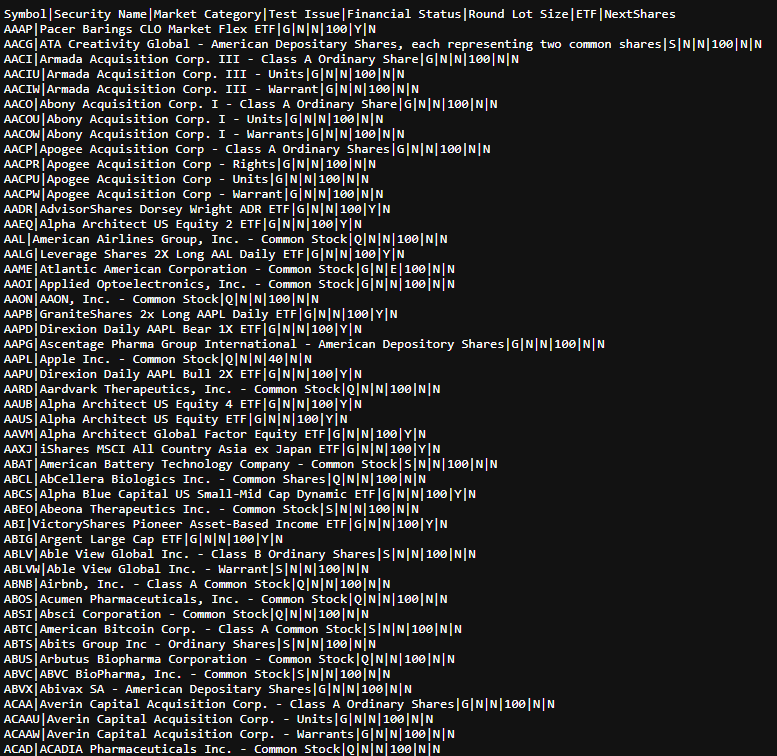
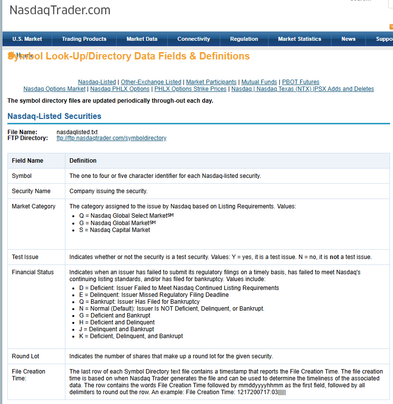

# Laboratory 2 — Quantify Dashboard Reads

**Student:** Oprea Alexandru · **Group:** InfA241 · **Language:** English  
**Product:** Personal Investment Dashboard · **Research date:** 21 September 2026

[Laboratory index](../README.md) · [Lab 1](../lab-1/README.md) · [Assignment](https://github.com/AlexOp27-z/system-design-labs/blob/main/labs/02-quality-and-estimates/README.md) · [Lecture 3](https://github.com/AlexOp27-z/system-design-labs/blob/main/lectures/lecture-03-quality-requirements-workload-and-capacity.md)

This is a requirements and estimation exercise, not a report of measured production performance. All targets not supplied by the client are explicitly selected assumptions. No internal architecture or technology is selected.

The Lab 1 boundary is unchanged: one authenticated human actor, the Dashboard, and one external Market Data Provider. The six reads are Overview, Filter, Stock price, History, Watchlist, and Search. Stock detail produces the Stock price and History reads in the workload model. A Watchlist is private; an unavailable price is not zero.

## 1. Quality requirements

### 1.1 Measurement and operating assumptions

- **Read boundary:** from receipt of a complete authenticated request by the Dashboard to transmission of its final response byte. Dependency waiting is included; the user's network and rendering time are excluded. Client-observed timings should be recorded separately before claiming that the interaction feels immediate.
- **Workload:** the exact six-read mix in section 2, at 300, 3,000, and 30,000 concurrent users. Busy conditions include section 3's market-open burst and its capacity margin.
- **Valid data result:** a correct, scope-compliant result that satisfies the freshness/ownership rules below. A legitimate empty search or empty Watchlist is valid. An error, timeout, fabricated value, unauthorised disclosure, or “Unavailable” result is not a successful data result.
- **Timing samples:** report each read class separately, including sample count, p50, p95, p99, timeout rate, unavailable rate, and rejected-access rate. Do not improve reported performance by silently dropping failed requests.
- **Important distinction:** a fast “Unavailable” response can meet a response-time target while failing useful-data throughput or availability. An intentional unsupported/unauthorised request is tested separately, not used to inflate successful data throughput.

### 1.2 Read latency

| ID | Measure | Target | Operating condition and rationale |
| --- | --- | --- | --- |
| LAT-1 | Within-Dashboard latency for correct Stock price reads | p50 ≤ 100 ms; p95 ≤ 500 ms | At every modelled workload, including the capacity target. These selected, stricter targets interpret the client's “should feel immediate”; they are not observed measurements. |
| LAT-2 | Within-Dashboard latency for correct reads, separately for each of the six classes | p95 ≤ 2,000 ms | During steady and busy periods. “Most” means at least 95%, not an average. Stock price must also satisfy LAT-1. |
| LAT-3 | Elapsed time before a read is declared timed out | 2,000 ms deadline | A correct result completed at exactly 2,000 ms passes. If it is not complete at that boundary, terminate the attempt with an explicit unavailable/timeout outcome rather than wait indefinitely or invent success. Count this attempt as a failure to return data. |

Latency percentiles and useful-result rates are separate measurements. In particular, many fast unavailable responses must not be reported as proof that the correct-read requirement is met.

### 1.3 Uptime-style availability

**Service definition:** the Dashboard is usable when a valid authenticated user can complete the six supported reads with correct identity/ownership, the required data or a legitimate empty result, and the applicable freshness/session labels within two seconds. Repeatedly returning “Unavailable” for otherwise valid, supported data requests is degraded service, not full uptime. Isolated unsupported symbols are not included as expected-success requests.

Measure availability with representative, authorised checks covering the six reads, corroborated by real request results. A failed check marks the interval until the next successful check as downtime; use a one-second interval for this design target. Report per-read uptime as well as overall uptime, where a failure of any required read makes the overall service unusable. Include maintenance and dependency failures. These are proposed measurement rules, not an assertion that monitoring is already implemented.

**Windows:** regular Nasdaq sessions, normally Monday–Friday **09:30–16:00 America/New_York**, excluding holidays and ending earlier on official early-close days. All other time belongs to the second window. Use the named timezone so daylight-saving changes are respected; do not assume a fixed UTC offset. The [official Nasdaq calendar and hours](https://www.nasdaq.com/market-activity/stock-market-holiday-schedule), reviewed on 21 September 2026, support this regular-session choice. Extended-hours trading is outside our product scope.

**Selected targets:** 99.99% during market hours (four nines), and 99.9% during the rest of the day (three nines). The tighter market-hours target reflects concentrated demand and the greater value of timely information. Outside those hours, labelled closing prices still matter, but a larger downtime budget is accepted. Four nines is a demanding design objective that requires later testing and operational investment, not a claim that the current project achieves it.

For an illustrative 30-day window, assume **22 full sessions and no early closes**, not that every actual month has this calendar:

```text
uptime = usable seconds / scheduled seconds in that window
downtime budget = scheduled seconds × (1 − target)

total time = 30 × 24 = 720 h
market time = 22 × 6.5 = 143 h = 514,800 s
remaining time = 720 − 143 = 577 h = 2,077,200 s
```

| Window, measured separately over the same 30 days | Target | Calculation | Allowed downtime |
| --- | --- | --- | --- |
| Regular market sessions | 99.99% | `514,800 s × 0.0001` | **51.48 seconds** |
| All remaining time | 99.9% | `2,077,200 s × 0.001` | **2,077.2 seconds = 34 minutes 37.2 seconds** |

For a real 30-day period, sum its actual scheduled session seconds first and recalculate both budgets. An outage crossing a session boundary is split between the two windows; the budgets cannot be pooled.

### 1.4 Consistency and freshness

**CON-1 — Market-price freshness.** The measure is `age = current time − provider_time`, evaluated when returning/displaying the result. In the normal regular-session state, 100% of returned prices must follow this table:

| Condition | Accepted product result |
| --- | --- |
| A valid price and timestamp with `0 ≤ age ≤ 15 min` | Show the price and its provider time. State that the product uses a delayed feed; do not claim real-time data. Exactly 15 minutes belongs here. |
| `15 min < age ≤ 20 min` | Show the price with a prominent “Delayed” label, provider time, and age. This is accepted bounded staleness, not a current/live quote. Exactly 20 minutes is still accepted and labelled. |
| `age > 20 min`, missing/invalid timestamp, future timestamp, invalid price, or unsupported instrument | Return “Unavailable” for a current price. A separately labelled historical close may still be shown; it does not satisfy the current-price request. |

The maximum accepted normal-session age is **20 minutes**, selected as the expected 15-minute provider delay plus five minutes of tolerance. The 15-minute value is a client input, not a measured promise by a chosen vendor. An invalid zero or a missing value is never manufactured into a price.

**Session-boundary rules:** daily closes age over nights and weekends without becoming new real-time quotations. Apply the following explicit exceptions only when the market calendar is known:

| Period | Permitted result and limit |
| --- | --- |
| Before the next session opens, after the closing grace period | The confirmed official close from the most recently completed regular session, with its date/time and “Market closed”. It remains acceptable across weekends/holidays until the next scheduled open. A close from an earlier session is unavailable for this purpose. |
| From the scheduled open through the first 20 minutes | Until the first acceptable current-session quote arrives, allow the previous session's confirmed close, labelled “Market open — awaiting delayed quote” with the old session date. It is not presented as a current-session price. After 20 minutes, normal-session freshness rules apply with no old-close substitution. |
| From scheduled close through the next 20 minutes | Until the official close arrives, allow the last current-session quote that was acceptable at close, labelled “Market closed — final price pending”. After 20 minutes, require that session's confirmed close or show “Unavailable”. This deliberate grace period accommodates the delayed feed. |
| Unknown session/calendar, or inactive instrument | Do not use an assumed closed-market exemption. Show market/current-price status unavailable; valid retained historical information remains distinguishable. |

A missing first/closing quote beyond the selected grace period is a service failure, not a reason to extend the grace indefinitely. These rules apply to prices in Overview, Stock detail, and Watchlist consistently.

**CON-2 — Read your own Watchlist changes.** Measure violations of the confirmed-write order. After an add/remove completes with a success confirmation, **100% of that user's reads that start afterwards must include that change or a later confirmed change**, until a later operation supersedes it. This includes a later session of the same user, not just one device. If correct state cannot be returned, show unavailable rather than an older state presented as current; this preserves correctness but fails availability. Duplicate add/remove operations do not create conflicting results.

**CON-3 — Ownership.** In all operating conditions, the number of successful cross-user Watchlist reads or writes must be **zero**. Reject unauthenticated and unauthorised operations without exposing another user's selections. This is a correctness rule, not a percentage of tolerated privacy failures.

### 1.5 Read throughput

**THR-1:** under the six-read mix, the Dashboard must complete acceptable reads at the following rates while LAT-1/LAT-2 and CON-1/CON-2/CON-3 continue to hold:

| Concurrent users | Steady acceptable completions | Tested peak capacity |
| --- | --- | --- |
| 300 | **79.2 reads/s** | **103 reads/s** |
| 3,000 | **792 reads/s** | **1,030 reads/s** |
| 30,000 | **7,920 reads/s** | **10,296 reads/s** |

The rates are derived below, not invented multipliers. Count **completed acceptable reads**, not started requests. Exclude incorrect, unavailable, timed-out, and unauthorised results from this counter. Empty results count only when they are actually correct.

Selected validation conditions: a representative populated data set, an authenticated workload, and functioning provider data within the agreed age range; measure a 15-minute steady test and a 60-second sustained peak test after warm-up. Also replay the actual ten-second opening event. The longer peak test is a conservative capacity check, not a change to the client's ten-second estimate. No ever-growing backlog is acceptable. Dependency-failure tests separately verify unavailable results and downtime accounting. The figures estimate **read capacity only**; no unprovided Watchlist-write or authentication request rate is inferred.

## 2. Steady-state RPS estimates

**Inputs:** the client-supplied percentages and frequencies are unchanged. Shares may overlap because one user can perform several different actions. They do not represent mutually exclusive populations.

```text
RPS = concurrent users × participating share × actions per user / seconds
units = users × fraction × requests/user / seconds = requests/second
```

Each listed action creates one Dashboard request. Exclude retries, sign-in, Watchlist mutations, and background synchronisation from this six-read model. A Dashboard request does **not** imply a provider request.

All results below are exact for the supplied inputs; **every cell is in requests/second (RPS)**.

| Read and behaviour | 300 users | 3,000 users | 30,000 users |
| --- | --- | --- | --- |
| Overview: 70%, once/30 s | `300 × 0.70 × 1 / 30 = 7` | `3,000 × 0.70 × 1 / 30 = 70` | `30,000 × 0.70 × 1 / 30 = 700` |
| Filter: 50%, three/60 s | `300 × 0.50 × 3 / 60 = 7.5` | `3,000 × 0.50 × 3 / 60 = 75` | `30,000 × 0.50 × 3 / 60 = 750` |
| Stock price: 20%, once/1 s | `300 × 0.20 × 1 / 1 = 60` | `3,000 × 0.20 × 1 / 1 = 600` | `30,000 × 0.20 × 1 / 1 = 6,000` |
| History: 20%, once/300 s | `300 × 0.20 × 1 / 300 = 0.2` | `3,000 × 0.20 × 1 / 300 = 2` | `30,000 × 0.20 × 1 / 300 = 20` |
| Watchlist: 60%, once/60 s | `300 × 0.60 × 1 / 60 = 3` | `3,000 × 0.60 × 1 / 60 = 30` | `30,000 × 0.60 × 1 / 60 = 300` |
| Search: 10%, three/60 s | `300 × 0.10 × 3 / 60 = 1.5` | `3,000 × 0.10 × 3 / 60 = 15` | `30,000 × 0.10 × 3 / 60 = 150` |
| **Steady total** | `7 + 7.5 + 60 + 0.2 + 3 + 1.5` = **79.2 RPS** | `70 + 75 + 600 + 2 + 30 + 15` = **792 RPS** | `700 + 750 + 6,000 + 20 + 300 + 150` = **7,920 RPS** |

Stock price contributes `6,000 / 7,920 × 100 ≈ 75.76%` of steady requests at the largest scale. This identifies a measurement priority, not a proven bottleneck.

## 3. Market-open RPS estimates

During the ten-second opening interval, 30% of all concurrent users perform one **additional** Overview refresh. Of that same group, 60% also refresh Watchlist: the Watchlist participation share is `0.30 × 0.60 = 0.18`, not 0.60 of everyone. The six steady flows continue once, unchanged.

All intermediate values are kept unrounded. Every numeric rate in this table is **RPS**.

| Calculation | 300 users | 3,000 users | 30,000 users |
| --- | --- | --- | --- |
| Continuing steady reads | 79.2 | 792 | 7,920 |
| Extra Overview | `300 × 0.30 / 10 = 9` | `3,000 × 0.30 / 10 = 90` | `30,000 × 0.30 / 10 = 900` |
| Extra Watchlist | `300 × 0.30 × 0.60 / 10 = 5.4` | `3,000 × 0.30 × 0.60 / 10 = 54` | `30,000 × 0.30 × 0.60 / 10 = 540` |
| **Market-open subtotal** | `79.2 + 9 + 5.4 = 93.6` | `792 + 90 + 54 = 936` | `7,920 + 900 + 540 = 9,360` |
| 10% capacity margin | `93.6 × 0.10 = 9.36` | `936 × 0.10 = 93.6` | `9,360 × 0.10 = 936` |
| Subtotal plus margin | `93.6 + 9.36 = 102.96` | `936 + 93.6 = 1,029.6` | `9,360 + 936 = 10,296` |
| **Final rounded-up capacity** | `ceil(102.96)` = **103 RPS** | `ceil(1,029.6)` = **1,030 RPS** | `ceil(10,296)` = **10,296 RPS** |

The burst is an average over the specified ten seconds; the brief does not describe subsecond clustering. A later test should vary arrival clustering rather than claim this estimate covers arbitrary instantaneous spikes. The 10% margin is capacity allowance, not evidence about retries or provider limits.

## 4. Storage estimates

### 4.1 Research and definition of a Stock

An equity share is an ownership interest, but market-data catalogues also include instruments that are not ordinary company shares. [Investor.gov's stock explanation](https://www.investor.gov/introduction-investing/investing-basics/investment-products/stocks) distinguishes common and preferred stock. The [SEC's ADR glossary entry](https://www.investor.gov/introduction-investing/investing-basics/glossary/american-depositary-receipts-adrs) identifies depositary receipts as a separate concept. Both were reviewed on 21 September 2026.

**Product definition:** one Stock is one supported Nasdaq-listed, USD-quoted common/ordinary equity class or an ADR/ADS representing common equity. Count distinct instrument listings, not issuer names: two share classes can be two Stocks. A stable product identifier distinguishes an instrument from a reused or changed ticker.

| Scope decision | Version 1 rule | Reason |
| --- | --- | --- |
| Market/country | The US Nasdaq listing market, including eligible foreign issuers listed there; no other exchange or currency conversion. | Keeps one regular-session calendar and one quote currency. Issuer domicile is not the same as listing market. |
| Included types | Common/ordinary equity and equity ADRs/ADSs, subject to provider validation. | Supports company-price monitoring without broadening into a multi-asset product. |
| Excluded types | Preferred shares and preferred depositary shares, ETFs/funds, bonds/notes, derivatives, warrants, rights, units, test issues, and unsupported currencies. | Different instrument semantics are outside the promise. “Not an ETF” alone is not proof that a security is common stock. |
| Inactive/delisted instruments | No new search/additions; existing entries remain identifiable and removable. Keep reference information and the last valid quote labelled historical for seven years after delisting; retain available closes only within the rolling seven-year history window. | Avoids silently losing the meaning of a user's existing list. No new prices are invented after delisting. |
| Historical resolution | One unadjusted regular-session close per stock per trading day, up to seven years. | Satisfies DASH-4; intraday OHLC, volume analysis, total-return calculations, and corporate-action adjustment calculations are not promised. |

**Research-driven scope decision:** the [Nasdaq directory definitions](https://www.nasdaqtrader.com/Trader.aspx?id=SymbolDirDefs) and the actual [Nasdaq-listed file](https://www.nasdaqtrader.com/dynamic/SymDir/nasdaqlisted.txt) distinguish test securities and contain mixed instrument types. Therefore, using a headline company/listing count as an exact number of eligible Stocks would be misleading. The estimate below explicitly filters candidate instruments and leaves final type/currency validation to the future provider contract.

### 4.2 Evidence-based instrument-count estimate

Observation on **21 September 2026**, from the file with footer **`File Creation Time: 0921202608:01`**. The footer's time is quoted as supplied, without inventing its timezone. The download was checked for a complete footer; a truncated file was not used for the count.

| Counting stage | Observed/derived count | Meaning |
| --- | ---: | --- |
| All security rows, excluding the header and creation-time footer | **5,623** | Mixed Nasdaq-listed securities, not all eligible Stocks. |
| Non-test, non-ETF, non-NextShares rows | **4,340** | Preliminary candidates; still contains warrants, preferred securities, etc. |
| Remaining names matching common/ordinary/capital stock or equity ADR/ADS patterns after the exclusions below | **3,381** | Reproducible **name-based estimate**, not a certified security-master count. |
| Planning count | **3,400 Stocks** | `ceil(3,381 / 100) × 100`; rounded up to the next hundred for estimation. This is an assumption, not an observed exact count. |

The public file does not provide a complete normalised instrument type and currency classification. Name matching can misclassify or miss instruments; the provider must validate eligibility before a Stock is exposed to users. Financial-status warnings are not treated as proof of delisting. The rounding allowance does not eliminate classification uncertainty. Section 4.8 shows sensitivity to a larger universe.

For reproducibility, the downloaded raw file contained **349,031 bytes** and had SHA-256 **`6ae61b435613d0fc184ba2460f625124121896fbb80f03b52c12254f1e30ba3e`**. Its LF-normalised text hash was **`8c5b5c7e3ada1522b7a573d79526b3d9a9ed4b6e5f607cdd9b23902f7e60a01f`**. A later download can legitimately have different data, counts, and hashes.

The following small research script reproduces the counting method from a downloaded `nasdaqlisted.txt`. It is an estimation aid, not a technology choice for the Dashboard:

```python
import csv
import hashlib
import io
import math
import re
from pathlib import Path

raw = Path("nasdaqlisted.txt").read_bytes()
text = raw.decode("utf-8-sig")
lines = text.splitlines()
assert lines[-1].startswith("File Creation Time:"), "Incomplete download"
rows = list(csv.DictReader(io.StringIO("\n".join(lines[:-1])), delimiter="|"))
base = [r for r in rows if r["Test Issue"] == "N"
        and r["ETF"] == "N" and r["NextShares"] == "N"]
exclude = re.compile(
    r"\b(preferred|preference|warrants?|rights?|units?|notes?|debentures?|"
    r"bonds?|fund|ETF|ETN|trust certificates)\b", re.I)
common = re.compile(r"\b(common|ordinary|capital)\s+(stock|shares?)\b", re.I)
adr = re.compile(r"\b(american deposit[ao]ry (shares?|receipts?)|ADSs?|ADRs?)\b", re.I)
candidates = [r for r in base if not exclude.search(r["Security Name"])
              and (common.search(r["Security Name"])
                   or adr.search(r["Security Name"]))]
assert len({r["Symbol"] for r in rows}) == len(rows), "Duplicate symbols"
print(lines[-1])
print("SHA-256:", hashlib.sha256(raw).hexdigest())
print("All / preliminary / estimated:", len(rows), len(base), len(candidates))
print("Planning count:", math.ceil(len(candidates) / 100) * 100)
```

### 4.3 Selected synchronised data

All datasets below are obtained through the **single Market Data Provider** in Lab 1. Public research sources are not additional runtime dependencies. Provider coverage/licensing and actual latency remain implementation assumptions to validate, not facts established by the public symbol file.

| Dataset and retained fields | Product need | Retention and selected synchronisation assumption |
| --- | --- | --- |
| Reference: stable `stock_id`, symbol, name, exchange, sector, currency, instrument type, active/delisted status, delisting date, source-update time | Identity and scope for DASH-1/2/3/4; stable Watchlist entries in DASH-5. Unknown sectors remain explicit. | One current record per active instrument; keep a delisted record for seven years after delisting. Refresh daily and reconcile listing/corporate-identity changes. The ID is assigned by the Dashboard; provider fields establish identity. |
| Latest quote: `stock_id`, price, previous regular-session close, provider time, session date, intraday/final-close kind, last synchronisation time | Overview/Stock price/Watchlist; provider-age checks; absolute and percentage change when previous close exists. | One latest record per instrument, replaced in place. Synchronise every **60 seconds** during regular sessions and the first 20 minutes after close; allow up to **60 additional seconds** for processing as a planning assumption. Inactive values are historical only. |
| History: `stock_id`, session date, unadjusted close, provider time, price-basis label | DASH-4's daily price history with explicit missing points and basis. | Backfill up to seven years at launch; append one point per completed trading day; prune beyond seven years. Reconcile provider corrections daily; never create pre-listing points. |
| Session calendar: exchange, date, open/close time, timezone, regular/early-close/closed state, provider-update time | Correct open/closed interpretation, freshness exceptions, and availability windows. | Maintain a rolling **366-date** calendar, replacing expired dates. Refresh the schedule daily and session changes every 60 seconds during market activity; unavailable/unknown state cannot silently activate an exception. |

**Why one-minute synchronisation:** a quote already delayed by 15 minutes could reach about 30 minutes of age if fetched only every 15 minutes. Under the selected normal conditions, `15 min provider delay + 1 min polling interval + 1 min processing ≤ 17 min`, leaving three minutes within the 20-minute limit. This is a conditional freshness budget, not a guarantee for halted/illiquid stocks or a failed provider. Age is re-evaluated for every result. No provider-request RPS is inferred from the polling assumption; batching, limits, and delivery behaviour require a separate model.

Do not persist redundant derived fields without a reason: price change is derived from price and previous close; freshness labels from provider time and calendar. News, logos, fundamentals, technical indicators, broker balances, and tick/OHLC data are excluded because no selected user story needs them. Private Watchlist data is user data, not provider market data, and is outside this storage total.

### 4.4 Representative records and byte measurement

The following **synthetic** records are representative sizing examples, not real observed prices or existing users. For a transparent, storage-engine-independent estimate, measure compact UTF-8 JSON with one LF byte after each record, no indentation/BOM, and no escaping of ASCII characters. Monetary strings preserve the illustrated precision. This is a sizing convention, not a decision to implement a JSON database.

**Stock reference — three samples:**

```json
{"stock_id":"STK-000001","symbol":"DEMO","name":"Example Corporation","exchange":"NASDAQ","sector":"Technology","currency":"USD","type":"COMMON","status":"ACTIVE","delisted_on":null,"updated_at":"2026-09-21T12:00:00Z"}
{"stock_id":"STK-000002","symbol":"SAMPB","name":"Example International Holdings Class B","exchange":"NASDAQ","sector":"Consumer Discretionary","currency":"USD","type":"COMMON","status":"ACTIVE","delisted_on":null,"updated_at":"2026-09-21T12:00:00Z"}
{"stock_id":"STK-000003","symbol":"TESTA","name":"Example Overseas Depositary Shares","exchange":"NASDAQ","sector":"Health Care","currency":"USD","type":"ADR","status":"DELISTED","delisted_on":"2026-09-18","updated_at":"2026-09-21T12:00:00Z"}
```

**Latest quotes — three samples:**

```json
{"stock_id":"STK-000001","price":"123.4500","previous_close":"120.0000","provider_time":"2026-09-21T14:00:00Z","session_date":"2026-09-21","kind":"INTRADAY","synced_at":"2026-09-21T14:16:00Z"}
{"stock_id":"STK-000002","price":"7.8000","previous_close":"7.6000","provider_time":"2026-09-21T14:00:00Z","session_date":"2026-09-21","kind":"INTRADAY","synced_at":"2026-09-21T14:16:00Z"}
{"stock_id":"STK-000003","price":"1000.1000","previous_close":"995.2000","provider_time":"2026-09-18T20:00:00Z","session_date":"2026-09-18","kind":"CLOSE","synced_at":"2026-09-18T20:16:00Z"}
```

**Daily history — three samples:**

```json
{"stock_id":"STK-000001","date":"2026-09-18","close":"123.4500","provider_time":"2026-09-18T20:00:00Z","basis":"UNADJUSTED"}
{"stock_id":"STK-000002","date":"2026-09-18","close":"7.8000","provider_time":"2026-09-18T20:00:00Z","basis":"UNADJUSTED"}
{"stock_id":"STK-000003","date":"2026-09-18","close":"1000.1000","provider_time":"2026-09-18T20:00:00Z","basis":"UNADJUSTED"}
```

**Session calendar — regular, early-close, and closed-day samples:**

```json
{"exchange":"NASDAQ","date":"2026-09-21","open":"2026-09-21T13:30:00Z","close":"2026-09-21T20:00:00Z","timezone":"America/New_York","state":"REGULAR","provider_time":"2026-09-21T12:00:00Z"}
{"exchange":"NASDAQ","date":"2026-11-27","open":"2026-11-27T14:30:00Z","close":"2026-11-27T18:00:00Z","timezone":"America/New_York","state":"EARLY_CLOSE","provider_time":"2026-11-27T13:00:00Z"}
{"exchange":"NASDAQ","date":"2026-09-20","open":null,"close":null,"timezone":"America/New_York","state":"CLOSED","provider_time":"2026-09-20T12:00:00Z"}
```

The byte measurement is reproducible with the following Python calculation:

```python
import json

sample = '''{"stock_id":"STK-000001","date":"2026-09-18","close":"123.4500","provider_time":"2026-09-18T20:00:00Z","basis":"UNADJUSTED"}'''
records = [json.loads(line) for line in sample.splitlines() if line.strip()]
sizes = [len((json.dumps(r, ensure_ascii=False, separators=(",", ":")) + "\n")
             .encode("utf-8")) for r in records]
print(sizes, "average =", sum(sizes) / len(sizes), "bytes/record")
```

| Dataset | Measured sample bytes, including LF | Sample mean | Adopted average for planning |
| --- | --- | --- | --- |
| Reference | 219, 251, 243 | `713 / 3 = 237.666… B` | **256 B/record** |
| Latest quote | 193, 189, 191 | `573 / 3 = 191 B` | **208 B/record** |
| Daily history | 125, 123, 126 | `374 / 3 = 124.666… B` | **128 B/record** |
| Session calendar | 190, 194, 153 | `537 / 3 = 179 B` | **208 B/record** |

The adopted averages deliberately sit above these tiny samples; they are **estimates**, not maximum field sizes or a statistically representative production measurement. Long names, additional metadata, and encoding can change them. The raw model excludes database/index overhead, replicas, backups, logs, compression, and network envelopes. Those costs cannot be inferred from these samples alone.

### 4.5 Initial raw storage

Baseline assumptions: **3,400 active Stocks**, initially no pre-existing delisted archive; one daily close; **252 trading days/year** as a planning assumption, not a statement about every calendar year; and **7 retained years = 1,764 trading days**. Assume full history for every instrument to obtain a conservative launch estimate. Recently listed stocks or missing points use fewer records.

Units: `1 MB = 1,000,000 B` and `1 GB = 1,000,000,000 B`. Decimal MB/GB are not MiB/GiB.

```text
raw bytes = record count × average bytes/record
history records = supported Stocks × points/Stock/trading day × retained trading days
                = 3,400 × 1 × 252 × 7 = 5,997,600
```

| Dataset | Product decision and retention | Record-count calculation | Average B/record | Raw bytes | Decimal MB |
| --- | --- | --- | ---: | ---: | ---: |
| Stock reference | One current record per active Stock; initial active population only | `3,400` | 256 | 870,400 | 0.870400 |
| Latest quotes | One record per active Stock; replace rather than append on refresh | `3,400` | 208 | 707,200 | 0.707200 |
| Price history | One daily close, seven-year backfill/rolling retention | `3,400 × 1 × 252 × 7 = 5,997,600` | 128 | 767,692,800 | 767.692800 |
| Session calendar | Current/future schedule, rolling 366-date allowance | `366` | 208 | 76,128 | 0.076128 |
| **Initial total** | **After backfill; no archive yet** | **6,004,766 records** | — | **769,346,528 B** | **769.346528 MB ≈ 0.769347 GB** |

Refreshing latest quotes once a minute changes write activity, not retained record count. Multiplying every refresh by the full retention period would incorrectly turn this dataset into intraday history.

### 4.6 Daily and one-year storage

| Quantity | Calculation | Result |
| --- | --- | --- |
| New history per trading day | `3,400 × 1 × 128 B` | **435,200 B = 0.4352 MB** gross |
| New history per closed/non-trading day | `0 × 128 B` | **0 B** |
| New history over 252 sessions | `3,400 × 252 × 128 B` | **109,670,400 B = 109.6704 MB/year** gross |
| One-year retained total, unchanged universe after the seven-year backfill | Initial total + new year's history − expired oldest year's history | **769,346,528 B ≈ 0.769347 GB** |

The last row assumes a stable population and comparable session counts: after a full seven-year backfill, the rolling window replaces old history, so gross ingestion is not the same as net storage growth. The calendar rolls and latest/reference records are replaced. History corrections replace their existing daily point rather than double-count it. A one-year-only history would occupy 109.6704 MB, but that is **not** the selected seven-year product.

### 4.7 Inactive/delisted retention allowance

The baseline must not silently ignore the decision to keep inactive instruments. Use a separate, explicitly **unmeasured planning scenario**: 5% of the active population is replaced each year, active count remains 3,400, and every retired record is kept for seven years. This is not a claimed Nasdaq delisting rate.

```text
annual retired/new instruments = 3,400 × 0.05 = 170
mature archived identities = 170 × 7 = 1,190
raw envelope per additional identity
  = 256 B reference + 208 B last historical quote + (1,764 × 128 B) history
  = 226,256 B
```

| Scenario | Additional raw allowance | Total with the baseline |
| --- | --- | --- |
| End of year 1: up to 170 retained retired identities alongside the active set | `170 × 226,256 = 38,463,520 B` | **807,810,048 B ≈ 0.807810 GB** |
| Mature seven-year archive: up to 1,190 retained retired identities | `1,190 × 226,256 = 269,244,640 B` | **1,038,591,168 B ≈ 1.038591 GB** |

These are conservative envelopes: each archived identity is allocated a full seven years of daily history even though old points expire and delisted instruments stop producing new points. They also allow full backfill for replacements. The allowance is not added every year indefinitely; retired reference/last-quote records expire seven years after delisting. Actual listing changes, history coverage, and provider corrections must be measured before a physical storage budget is chosen.

### 4.8 Sensitivity and limitations

- Increasing the active universe by 25%, from 3,400 to 4,250, changes the baseline to `4,250 × (256 + 208 + 1,764 × 128) + 366 × 208 = 961,664,128 B`, about **0.961664 GB**. The number of users does not itself multiply a shared market-data history.
- A tenfold user increase from 3,000 to 30,000 multiplies unrounded steady/burst workload by ten with behaviour fixed. Recompute the final ceiling: `1,029.6 × 10 = 10,296 RPS`; do not multiply the already-rounded 1,030 target to obtain 10,300.
- A 20% increase in average record sizes increases the corresponding raw dataset sizes by 20%. Changing history to intraday points would require a new product decision and a new model.
- Licensing, provider limits, actual average record sizes, classification accuracy, and real traffic distribution remain assumptions to validate before implementation. This lab estimates them transparently; it does not claim a deployed system or completed load tests.

### 4.9 Research evidence

**Figure 1 — Instrument definition.** The common/preferred distinction in [Investor.gov's Stocks page](https://www.investor.gov/introduction-investing/investing-basics/investment-products/stocks) supports the explicit exclusion of preferred instruments.


**Figure 2 — Directory evidence.** The [Nasdaq-listed file](https://www.nasdaqtrader.com/dynamic/SymDir/nasdaqlisted.txt) contains both equity candidates and excluded instrument types. The snapshot date and derived counts used in this estimate are documented in section 4.2.



**Figure 3 — Classification and source timestamp.** The Test Issue and File Creation Time fields in [Nasdaq's directory definitions](https://www.nasdaqtrader.com/Trader.aspx?id=SymbolDirDefs) support filtering test issues and recording the observation date of the instrument-count estimate.



## 5. Potential bottlenecks

These are hypotheses, not measured diagnoses. Each links a path or dependency to a quality target and a test capable of confirming or rejecting the concern.

| Quality | Potential bottleneck / pressure path | Evidence from this lab | Possible user-visible effect | Measurement to confirm or reject |
| --- | --- | --- | --- | --- |
| Latency | Repeated Stock price work under concurrent reads | 6,000 of 7,920 steady RPS, about 75.76%; LAT-1 is stricter than the other classes. | Price p95 exceeds 500 ms or reads miss the two-second deadline. | Measure per-class p50/p95/p99, elapsed dependency/processing/wait time, and deadline failures at all three scales. Reject the hypothesis if this path retains its latency margin under representative skew. |
| Latency | Returning a long History result | Up to 1,764 daily points per Stock; only 20 History RPS at the largest scale, but more data per result than a quote. | History p95 exceeds two seconds despite a low request count. | Vary requested date range and missing-point coverage; measure result bytes, construction time, and latency. Stored raw bytes are not assumed to equal response bytes. |
| Consistency | Provider delay plus synchronisation/processing delay | Expected 15-minute source delay; selected one-minute synchronisation and one-minute processing budget; normal maximum age 20 minutes. | Too-old data appears current, or legitimate reads become unavailable. | Record provider time, receive time, display age, label accuracy, and unavailable rate; test exactly 15 and 20 minutes, just beyond them, missing/future timestamps, opening/closing grace, weekends, and holidays. |
| Consistency | Watchlist confirmation followed by concurrent reads | DASH-5 and CON-2 demand immediate read-your-writes, including later sessions. Read RPS alone says nothing about write correctness. | A confirmed addition disappears, a removed entry returns without a later add, or another user's data is exposed. | Record operation start/confirmation/read times per user; test two sessions, duplicate operations, two users, and deliberate ownership violations. Any stale successful read or cross-user disclosure fails the rule. |
| Throughput | Combined market-open workload | 9,360 RPS before margin; 10,296 RPS final target at 30,000 users; Overview and Watchlist bursts are additional. | Acceptable completions fall behind arrivals; backlog, unavailable responses, or deadline failures grow. | Measure offered versus acceptable completed RPS, outstanding work, errors, and each class's latency during the ten-second event and sustained peak test. Vary hot-symbol concentration. Starting 10,296 requests/s alone does not prove capacity. |
| Availability | Loss of the Market Data Provider or failure of a required Dashboard read | One external runtime dependency; fresh prices and known session state are needed. Market-hours downtime budget is only 51.48 seconds in the illustrative window. | Useful-data reads eventually fail when accepted data expires; a functioning page or quick error response hides a service outage. | Inject provider outages/delays and local read failures; measure time until each flow becomes unusable, recovery time, per-window downtime, and which valid stored results remain usable. A provider outage does not necessarily cause instant Dashboard downtime. |

**Conclusion:** the next design must handle repeated price reads, preserve confirmed private state, track provider age honestly, and serve the measured peak without hiding failures. First obtain path-specific timings, acceptable-completion counts, dependency behaviour, and representative record-size measurements. The estimates alone do not select a database, cache, replication method, deployment size, or provider-request strategy.
